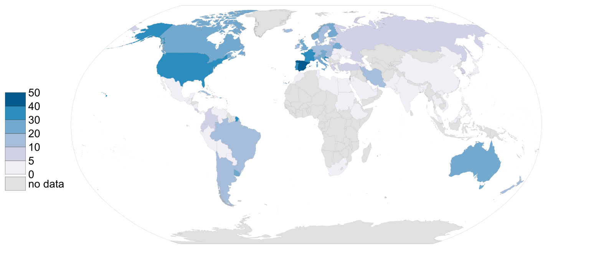

```{r setup, include=FALSE}
knitr::opts_chunk$set(echo = TRUE, tidy = 'styler')
knitr::opts_knit$set(global.par = TRUE)
rm(list = ls())
```

This is a quick post on how to create a map as per the [Wikipedia conventions](https://en.wikipedia.org/wiki/Wikipedia:WikiProject_Maps/Conventions#Gradient_maps). In this case I have chosen to plot the [international organ donor rates](https://en.wikipedia.org/wiki/International_organ_donor_rates), retrieved on 2019-02-10 although the data refers to 2017 (Source: [IRODaT](http://www.irodat.org/?p=database)).

## Webscrapping

First step is to webscrap Wikipedia in order to get the final table. For doing so, I will use the `rvest` library. You can get the `xpath` you want to webscrap as explained [here](https://stackoverflow.com/a/57972054/7877917).

```{r 20191016_libs, warning=FALSE, message=FALSE}
library(rvest)
library(dplyr)

Base <-
  read_html("https://en.wikipedia.org/wiki/International_organ_donor_rates") %>%
  html_nodes(xpath = '//*[@id="mw-content-text"]/div/table[3]') %>%
  html_table() %>%
  as.data.frame(stringsAsFactors = F,
                fix.empty.names = F) %>%
  select(Country,
         RateDonperMill = Number.of.deceased.donors..per.million.of.population)

knitr::kable(head(Base, 10), format = 'markdown')
```

Now we need to choose a [good source of maps](https://dieghernan.github.io/201906_Beautiful2/):

```{r 20191016_getmap, message=FALSE, warning=FALSE, paged.print=FALSE, results='hide'}
library(sf)
library(giscoR)

# Map import from Eurostat
WorldMap <- gisco_get_countries(resolution = 3, epsg = 3857) %>%
  select(ISO_3166_3 = ISO3_CODE)

```

## Merging all together

Now let's join and have a look to see what is going on. We use the `countrycode` package to retrieve the ISO3 codes of our scrapped dataset:

```{r 20191016_joining, message=FALSE, warning=FALSE, paged.print=FALSE}

library(countrycode)

Base$ISO_3166_3 <- countrycode(Base$Country, origin = "country.name", destination = "iso3c")


DonorRate = left_join(WorldMap,
                       Base) %>%
  select(Country,
         ISO_3166_3,
         RateDonperMill)

```

## Make the `.svg` file

As already explained, I would like to follow the Wikipedia conventions, so some things to bear in mind:

-   Obviously the colors. Wikipedia already provides a good guidance for this. I would make use of the `RColorBrewer` library, which implements [ColorBrewer](http://colorbrewer2.org/#type=sequential&scheme=PuBu&n=9) in **R**.
-   In terms of projection, Wikipedia recommends the [Equirectangular projection](https://en.wikipedia.org/wiki/Equirectangular_projection) but, as in their own sample of a gradient map, I would choose to use the [Robinson projection](https://en.wikipedia.org/wiki/Robinson_projection).
-   I should produce an `.svg` file following also the naming convention.

Some libraries then to use: `RColorBrewer`, `rsvg` and specially one of my favourites, `cartography`:

```{r 20191016_final, echo=TRUE, message=FALSE, warning=FALSE, eval=FALSE, paged.print=FALSE}
library(RColorBrewer)
library(cartography)
library(rsvg)

# Create bbox of the world
bbox <- st_linestring(rbind(c(-180, 90),
                            c(180, 90),
                            c(180, -90),
                            c(-180, -90),
                            c(-180, 90))) %>%
  st_segmentize(5) %>%
  st_cast("POLYGON") %>%
  st_sfc(crs = 4326) %>%
  st_transform(crs = "+proj=robin")

# Create SVG
svg(
  "Organ donor rate per million by country gradient map (2017).svg",
  pointsize = 90,
  width =  1600 / 90,
  height = 728 / 90
)

par(mar = c(0.5, 0, 0, 0))
choroLayer(
  DonorRate %>% st_transform("+proj=robin") ,
  var = "RateDonperMill",
  breaks = c(0, 5, 10, 20, 30, 40, 50),
  col = brewer.pal(6, "PuBu"),
  border = "#646464",
  lwd = 0.1,
  colNA = "#E0E0E0",
  legend.pos = "left",
  legend.title.txt = "",
  legend.values.cex = 0.25
)

# Bounding box
plot(bbox,
     add = T,
     border = "#646464",
     lwd = 0.2)

dev.off()


```

And that's all. Our `.svg` file is ready to be included in Wikipedia.

```{r 20191016_imgpost, message=FALSE, warning=FALSE, eval=FALSE, include=FALSE, paged.print=FALSE, results='hide'}
rsvg_png("Organ donor rate per million by country gradient map (2017).svg",
         "20191016_imgpost.png")
```



**Update**: The map is already part of the [Wikipedia article](https://en.wikipedia.org/wiki/International_organ_donor_rates#Global_Summary).
{: .alert .alert-info .p-3 .mx-2 .mb-3 }
