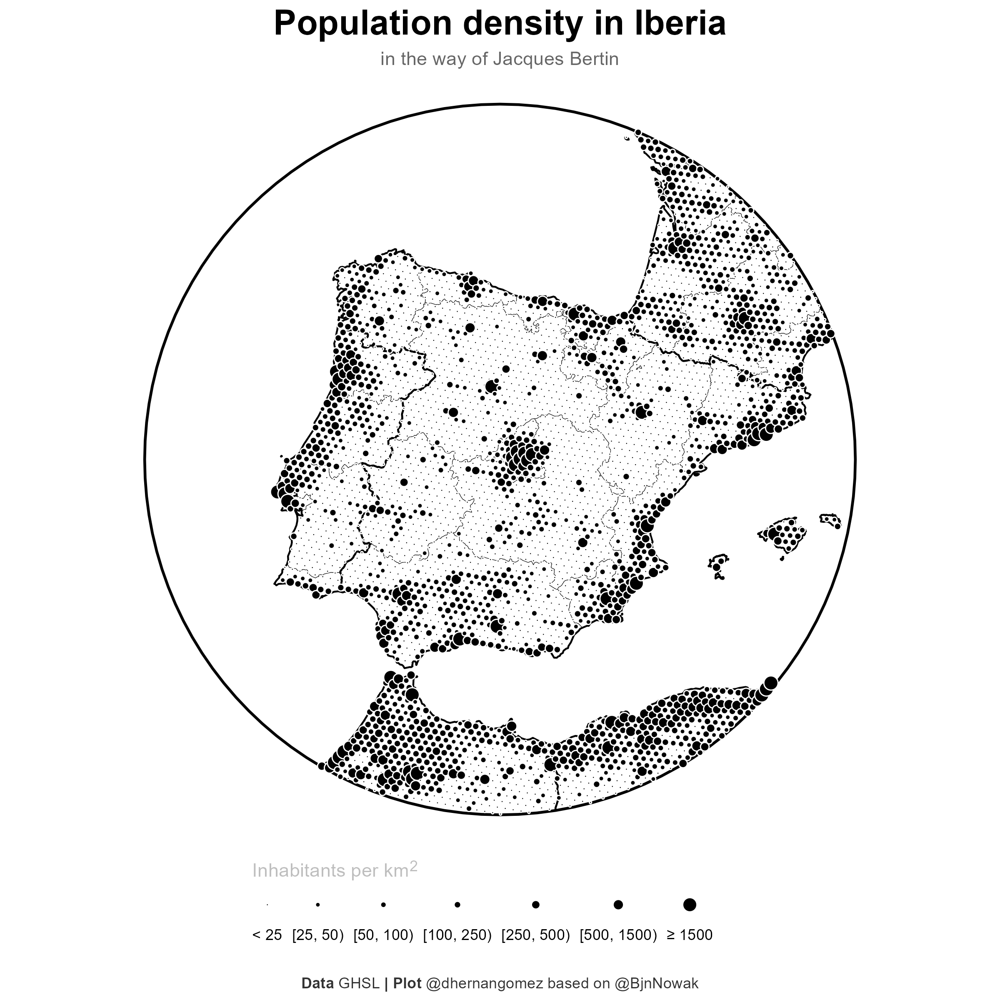

Recently the [R Graph Gallery](https://r-graph-gallery.com/) has
incorporated a new post by [Benjamin
Nowak](https://twitter.com/BjnNowak) showing how to create a dot density
map based on the work of the french cartographer [Jacques
Bertin](https://en.wikipedia.org/wiki/Jacques_Bertin) (1918 - 2010):

<figure>

<figcaption aria-hidden="true">Jacques Bertin, Sémiologie graphique. Les
diagrammes. Les réseaux. Les cartes (1967)</figcaption>
</figure>

In this post I would create a similar map for Iberia, and additionally I
would show how to create a variation using a hexagonal grid instead of a
rectangular one.

## Libraries

I would use the following libraries for loading, manipulating and
plotting spatial data (both raster and vector):

``` r
# Base spatial packages
library(terra)
library(sf)
# Spatial data
library(giscoR)
# Wrangling and plotting
library(tidyverse)
library(tidyterra)
library(ggtext)
# Additional for hex grids
# Supporting for units and bridge raster to polygon
library(units)
library(exactextractr)
```

## Get the data

The first step is always to get the data we need. My final map would use
as a base a circular layout with Iberia in the middle (that would be our
observation window), so we can get the corresponding shapes and create a
buffer around it.

After that, we would extract the population spatial distribution from
[GHSL - Global Human Settlement
Layer](https://ghsl.jrc.ec.europa.eu/download.php). We would use the
global file with a resolution of 1 km on Mollweide projection
(ESRI:54009).

``` r
# Create observation window based the Iberian Peninsula and surroundings
# We create a buffered circle
owin <- gisco_get_countries(
  country = c("ES", "PT"),
  # We buffer in 3035 since I want my final map on this projection
  epsg = 3035,
  resolution = 60
) %>%
  st_geometry() %>%
  st_union() %>%
  st_centroid(of_largest_polygon = TRUE) %>%
  st_buffer(750000) %>%
  # But for extracting raster data we need this in Mollweide so far
  st_transform(crs = "ESRI:54009")

# Get additional shapes and cut them to the owin
regions <- gisco_get_nuts(resolution = 3, nuts_level = 2) %>%
  st_transform(st_crs(owin)) %>%
  st_intersection(owin)

countries <- gisco_get_countries(resolution = 3) %>%
  st_transform(st_crs(owin)) %>%
  st_intersection(owin)

# Base map
base_gg <- ggplot() +
  geom_sf(data = regions, fill = NA, color = "black", linewidth = 0.1) +
  geom_sf(data = countries, fill = NA, linewidth = 0.5, color = "black") +
  geom_sf(data = owin, fill = NA, linewidth = 0.75, color = "black")

base_gg
```


That would be our base map. Now we download programmatically the GHSL
data and we would check that everything is correct. At this point, it is
interesting to use the `win` argument when reading the raster with
`terra::rast()`, as this would allow us to load only the desired area
with the subsequent improvement in terms of performance.

``` r
# Download data
# We need the following file (download 305Mb)
url <- "https://jeodpp.jrc.ec.europa.eu/ftp/jrc-opendata/GHSL/GHS_POP_GLOBE_R2023A/GHS_POP_E2030_GLOBE_R2023A_54009_1000/V1-0/GHS_POP_E2030_GLOBE_R2023A_54009_1000_V1_0.zip"

# This is where I would store the file, you would need to modify the folder
fname <- file.path("~/R/mapslib/GHS", basename(url))
if (!file.exists(fname)) {
  download.file(url, fname)
}
zip_content <- unzip(fname, list = TRUE)
zip_content
#>                                                 Name    Length
#> 1     GHS_POP_E2030_GLOBE_R2023A_54009_1000_V1_0.tif 263188307
#> 2 GHS_POP_E2030_GLOBE_R2023A_54009_1000_V1_0.tif.ovr  88461532
#> 3                         GHSL_Data_Package_2023.pdf   9761851
#> 4           GHS_POP_GLOBE_R2023A_input_metadata.xlsx    137963
#>                  Date
#> 1 2023-04-28 21:11:00
#> 2 2023-04-28 21:11:00
#> 3 2023-10-27 14:30:00
#> 4 2023-04-30 10:42:00

# Unzip
unzip(fname, exdir = "~/R/mapslib/GHS", junkpaths = TRUE, overwrite = FALSE)

# Create the path to the file
global_tiff <- zip_content$Name[grepl("tif$", zip_content$Name)]
global_tiff_path <- file.path("~/R/mapslib/GHS", global_tiff)

# And read cropping to our owin
pop_init <- rast(global_tiff_path, win = as_spatvector(owin))

# Consistent naming of the layer
names(pop_init) <- "population"

ncell(pop_init)
#> [1] 2255923

# And check with tidyterra
base_gg +
  geom_spatraster(data = pop_init, maxcell = 50000) +
  scale_fill_viridis_c(na.value = "transparent", alpha = 0.3)
```


## Data wrangling

The GHSL information contains the estimated population on each grid.
However the file has a high resolution (more than 2 millions of cells)
so for plotting purposes we are going to reduce (i.e. aggregate) the
number of cells so we can have a better dot visualization. Once that we
aggregate, we would compute the area of each new aggregated cell and
compute the corresponding population density.

Instead of using the numeric range of densities, we would use categories
for the final map, so we would classify the density into different
groups:

``` r
# Reduce resolution for visualization
# Compute factor to reduce raster to (aprox) 100 rows:
nrow(pop_init)
#> [1] 1511
factor <- round(nrow(pop_init) / 100)

# Each new cell would contain the sum of population of the aggregated cells
pop_agg <- terra::aggregate(pop_init,
  fact = factor, fun = "sum",
  na.rm = TRUE
)


# Compute area of each new cell
pop_agg$area_km2 <- cellSize(pop_agg, unit = "km")

# Compute densities, mask to owin, convert to points and create categories
pop_points <- pop_agg %>%
  # Compute density by cell
  mutate(dens = population / area_km2) %>%
  select(dens) %>%
  # Mask to the countries shapes
  mask(as_spatvector(countries), touches = FALSE) %>%
  # SpatVector as points
  as.points() %>%
  # Categorize
  mutate(cat = case_when(
    dens < 25 ~ "A",
    dens < 50 ~ "B",
    dens < 100 ~ "C",
    dens < 250 ~ "D",
    dens < 500 ~ "E",
    dens < 1500 ~ "F",
    TRUE ~ "G"
  ))
```

## Final plot

And finally the map. In this case I would save it as a high resolution
square map.

``` r
# Final plot
final_plot <- base_gg +
  # Layer, this object is a SpatVector instead of sf object
  geom_spatvector(
    pop_points,
    mapping = aes(size = cat),
    # Use a point with a border AND a fill
    pch = 21, color = "white", fill = "black", linewidth = 0.05
  ) +
  scale_size_manual(
    values = c(0.3, 1, 1.25, 1.5, 2, 2.5, 3.5),
    labels = c(
      "< 25", "[25, 50)", "[50, 100)", "[100, 250)",
      "[250, 500)", "[500, 1500)", "≥ 1500"
    ),
    guide = guide_legend(
      nrow = 1,
      title.position = "top",
      keywidth = 1,
      label.position = "bottom"
    )
  ) +
  labs(
    title = "**Population density in Iberia**",
    subtitle = "in the way of Jacques Bertin",
    size = "<span style='color:grey'>Inhabitants per km<sup>2</sup></span>",
    caption = "**Data** GHSL **| Plot** @dhernangomez based on @BjnNowak"
  ) +
  theme_void() +
  # This CRS for representation only
  coord_sf(expand = TRUE, crs = 3035) +
  theme(
    # plot.margin = margin(20,0,20,0,"cm"),
    plot.background = element_rect(fill = "white", color = NA),
    legend.position = "bottom",
    legend.margin = margin(r = 20, unit = "pt"),
    legend.title = element_markdown(),
    legend.key.width = unit(50, "pt"),
    plot.title = element_markdown(hjust = 0.5, size = 20),
    plot.subtitle = element_text(hjust = 0.5, color = "grey40"),
    plot.caption = element_markdown(
      color = "grey20",
      margin = margin(t = 20, b = 5, unit = "pt"),
      hjust = .5
    )
  )


ggsave("202312_finalmap.png", dpi = 300, width = 8, height = 8)
```


## Alternative hexagonal grid

The previous plot is based on the centroids of each cell of the raster,
that is, by definition, a rectangular grid. I would like also to
experiment with hexagonal grids (i.e. grid of hexagons) since I have the
feeling that looks more “natural” than the rectangular ones, that
presents a regularity hardly seen in the wild.

The issue here is that `terra` does not produce this type of grids,
however it is possible to create them with `sf::st_make_grid()`, so the
workflow for this altenative is:

1.  Create a hexagonal grid, where each hexagon represents a similar
    area than each cell on the aggregated raster.
2.  Extract the values of the raster to the new grid.
3.  Finally, follow the same steps on data wrangling and plotting.

When working with `sf::st_make_grid(square = FALSE)`, the parameter
`cellsize` should be the “diameter” of the hexagon instead of the area.
Luckly, we can infer this value since the area of a hexagon is

$$
A = \frac{\sqrt{3}}{2}d^{2}
$$

So we can extract $d$ from the previous expresion knowing the area $A$
of the aggregated cells:

``` r
# Hex grid with sf ----

# Avg size of the cells on the aggregated grid
target_area <- cellSize(pop_agg, unit = "km") %>%
  pull() %>%
  mean() %>%
  as_units("km^2")

target_area
#> 224.7461 [km^2]

# Infer diam hex
diam_hex <- sqrt(2 * target_area / sqrt(3))
# Create hexagonal grid
pop_agg_sf <- st_make_grid(owin, cellsize = diam_hex, square = FALSE)

length(pop_agg_sf)
#> [1] 10340
ncell(pop_agg)
#> [1] 10100

area_km2 <- st_area(pop_agg_sf) %>%
  set_units("km^2") %>%
  as.double()

pop_agg_sf <- st_sf(area_km2 = area_km2, geom = pop_agg_sf)
```

Now, we use `exact_extract()` to extract the population on each
hexagonal grid.

``` r
# Extract aggregated population by hex cell
pop_agg_sf$population <- exact_extract(pop_init,
  y = pop_agg_sf,
  progress = FALSE,
  fun = "sum"
)


base_gg +
  geom_sf(
    data = pop_agg_sf %>% filter(population > 0),
    aes(fill = population), color = NA
  ) +
  scale_fill_viridis_c(na.value = "transparent", alpha = 0.3)
```


Finally we just compute densities, create categories and finally the
map:

``` r
# Mask and categorize
pop_sf_points <- pop_agg_sf %>%
  # Compute density by cell
  mutate(dens = population / area_km2) %>%
  select(dens) %>%
  # To points and filter to country shape
  st_centroid(of_largest_polygon = TRUE) %>%
  st_filter(countries) %>%
  # Categorize
  mutate(cat = case_when(
    dens < 25 ~ "A",
    dens < 50 ~ "B",
    dens < 100 ~ "C",
    dens < 250 ~ "D",
    dens < 500 ~ "E",
    dens < 1500 ~ "F",
    TRUE ~ "G"
  ))


pop_sf_points %>%
  st_drop_geometry() %>%
  count(cat)
#>   cat    n
#> 1   A 2085
#> 2   B  571
#> 3   C  430
#> 4   D  451
#> 5   E  153
#> 6   F   92
#> 7   G   42


# Final plot
final_plot_hex <- base_gg +
  # Layer, this object is a sf object
  geom_sf(
    pop_sf_points,
    mapping = aes(size = cat),
    # Use a point with a border AND a fill
    pch = 21, color = "white", fill = "black", linewidth = 0.05
  ) +
  scale_size_manual(
    values = c(0.3, 1, 1.25, 1.5, 2, 2.5, 3.5),
    labels = c(
      "< 25", "[25, 50)", "[50, 100)", "[100, 250)",
      "[250, 500)", "[500, 1500)", "≥ 1500"
    ),
    guide = guide_legend(
      nrow = 1,
      title.position = "top",
      keywidth = 1,
      label.position = "bottom"
    )
  ) +
  labs(
    title = "**Population density in Iberia**",
    subtitle = "in the way of Jacques Bertin",
    size = "<span style='color:grey'>Inhabitants per km<sup>2</sup></span>",
    caption = "**Data** GHSL **| Plot** @dhernangomez based on @BjnNowak"
  ) +
  theme_void() +
  # This CRS for representation only
  coord_sf(expand = TRUE, crs = 3035) +
  theme(
    # plot.margin = margin(20,0,20,0,"cm"),
    plot.background = element_rect(fill = "white", color = NA),
    legend.position = "bottom",
    legend.margin = margin(r = 20, unit = "pt"),
    legend.title = element_markdown(),
    legend.key.width = unit(50, "pt"),
    plot.title = element_markdown(hjust = 0.5, size = 20),
    plot.subtitle = element_text(hjust = 0.5, color = "grey40"),
    plot.caption = element_markdown(
      color = "grey20",
      margin = margin(t = 20, b = 5, unit = "pt"),
      hjust = .5
    )
  )

ggsave("202312_finalmap_hex.png", dpi = 300, width = 8, height = 8)
```



And that’s it! Which one do you like the most? Let me know in the
comments.

## References

<div id="refs" class="references csl-bib-body hanging-indent">

<div id="ref-bertin1967" class="csl-entry">

Bertin, Jacques. 1967. *Sémiologie graphique. Les diagrammes. Les
réseaux. Les cartes*. Paris: Gauthier-Villars.

</div>

<div id="ref-europeancommission.jointresearchcentre.2023"
class="csl-entry">

European Commission. Joint Research Centre. 2023. *GHSL data package
2023.* LU: Publications Office. <https://doi.org/10.2760/098587>.

</div>

<div id="ref-R-tidyterra" class="csl-entry">

Hernangómez, Diego. 2023. “Using the
<span class="nocase">tidyverse</span> with
<span class="nocase">terra</span> Objects: The
<span class="nocase">tidyterra</span> Package.” *Journal of Open Source
Software* 8 (91): 5751. <https://doi.org/10.21105/joss.05751>.

</div>

<div id="ref-pesaresi2023" class="csl-entry">

Pesaresi, Martino, and Panagiotis Politis. 2023. “GHS-BUILT-C R2023A -
GHS Settlement Characteristics, Derived from Sentinel2 Composite (2018)
and Other GHS R2023A Data.” European Commission, Joint Research Centre
(JRC). <https://doi.org/10.2905/3C60DDF6-0586-4190-854B-F6AA0EDC2A30>.

</div>

</div>
