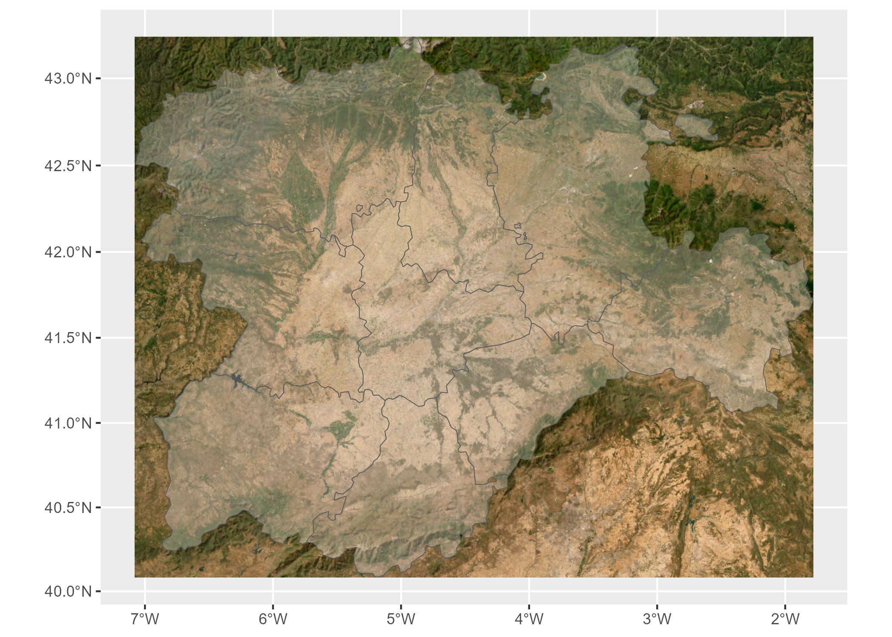
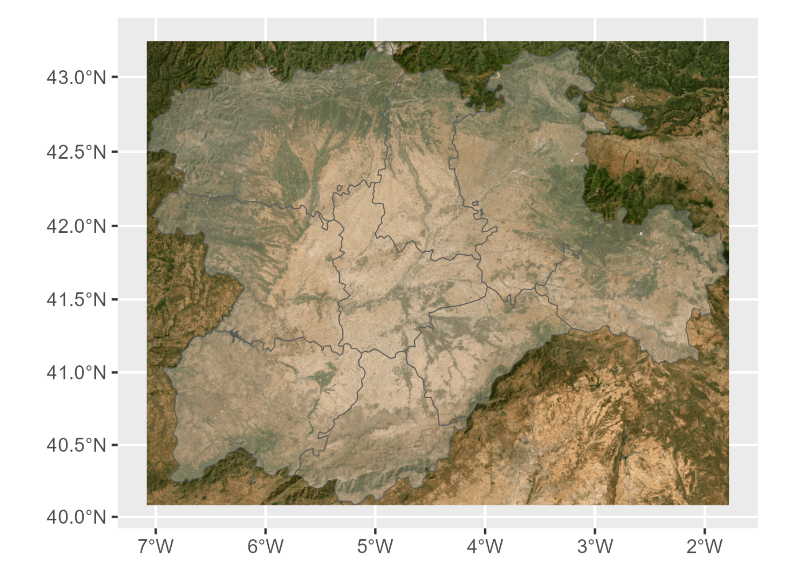
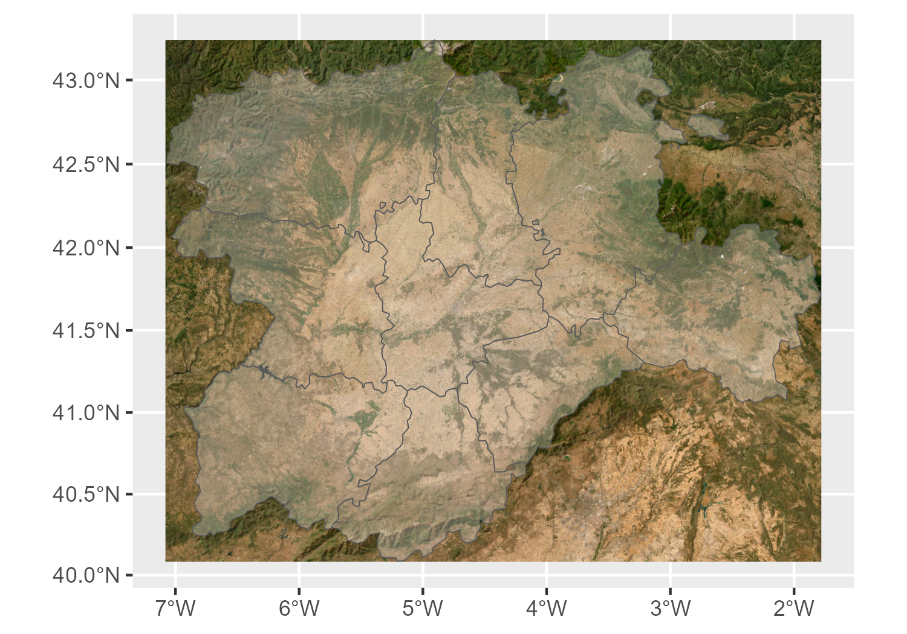

**resmush** package has recently hit
[CRAN](https://cran.r-project.org/package=resmush)! This is one tiny
utility package that allows to optimize (i.e. compress the size) of
local and online images using [reSmush.it](https://resmush.it/).

## What is reSmush.it?

reSmush.it is a **free online API** that provides image optimization,
and it has been implemented on Wordpress, Drupal or Magento. Some of the
features of reSmush.it are:

- Free optimization services, no API key required.
- Optimize local and online images.
- Image files supported: `png`, `jpg/jpeg`, `gif`, `bmp`, `tiff`,
  `webp`.
- Max image size: 5 Mb.
- Compression via several algorithms:
  - [**PNGQuant**](https://pngquant.org/): Strip unneeded chunks from
    `png`s, preserving a full alpha transparency.
  - [**JPEGOptim**](https://github.com/tjko/jpegoptim)**:** Lossless
    optimization based on optimizing the Huffman tables.
  - [**OptiPNG**](https://optipng.sourceforge.net/): `png` reducer that
    is used by several online optimizers.

## Why resmush package?

One of the main reasons I developed **resmush** is because I used to
ship [precomputed
vignettes](https://ropensci.org/blog/2019/12/08/precompute-vignettes/)
with my packages (see
[**tidyterra**](https://cran.r-project.org/web/packages/tidyterra/vignettes/welcome.html)
as an example). I found that the plots created on CRAN with the standard
configuration (i.e., not precomputed vignettes but built on CRAN itself)
are not very satisfying, and in some of the packages I developed
(especially those related to mapping), they don’t do justice to the
actual results when a use**R** runs them.

This approach has the drawback that it produces images of higher quality
at a expense of size. So, to avoid reaching [CRAN’s 5Mb max size
policy](https://cran.r-project.org/web/packages/policies.html), I
developed **resmush**, which enables me to reduce the size of the images
without a significant loss in quality

Another use case for **resmush** is optimizing images in the context of
web page development and SEO optimization. For example, I optimized all
the images on this blog using `resmush_dir()`, which is a shorthand for
optimizing all files in a specific folder.

There are other alternatives that I would discuss [at the end of this
post](#altern), but in one line, reSmush.it API performs fast with
minimal configuration for a wide range of formats without an API key.

## Using resmush package

### With local files

Let’s present an example of how a local file can be optimized. First we
create a large plot with **ggplot2**

``` r
library(tidyterra)
library(ggplot2)
library(terra)
library(maptiles)

cyl <- vect(system.file("extdata/cyl.gpkg", package = "tidyterra")) %>%
  project("EPSG:3857")
cyl_img <- get_tiles(cyl, "Esri.WorldImagery", zoom = 8, crop = TRUE)
cyl_gg <- autoplot(cyl_img, maxcell = Inf) +
  geom_spatvector(data = cyl, alpha = 0.3)

cyl_gg
```

<div class="figure">


<p class="caption">
Original file
</p>

</div>

``` r

# And we save it for resmushing
ggsave("cyl.png", width = 5, height = 0.7 * 5)
```

Cool, but the file has a size of 1.7 Mb. So we can use `resmush_file()`
to reduce it, see:

``` r
library(resmush)
resmush_file("cyl.png")
#> ══ resmush summary ═════════════════════════════════════════════════════════════
#> ℹ Input: 1 file with size 1.7 Mb
#> ✔ Success for 1 file: Size now is 762.2 Kb (was 1.7 Mb). Saved 948.9 Kb (55.46%).
#> See result in directory '.'.

png::readPNG("cyl_resmush.png") %>%
  grid::grid.raster()
```

<div class="figure">


<p class="caption">
Optimized file
</p>

</div>

By default `resmush_file()/resmush_dir()` do not overwrite the original
file, altough this may be modified with the parameter `overwrite = TRUE`
Now the resmushed file (“cyl_resmush.png”) has a size of 762.2 Kb.

Let’s compare them size-by-side:

<div class="figure">




<p class="caption">

Original picture (top) 1.7 Mb and optimized picture (bottom) 762.2 Kb
(Compression 55.46%)

</p>

</div>

We can chech the reduction of size without reducing the dimensions of
the image.

``` r
size_src <- file.size("cyl.png") %>%
  `class<-`("object_size") %>%
  format(units = "auto")
size_dest <- file.size("cyl_resmush.png") %>%
  `class<-`("object_size") %>%
  format(units = "auto")

dim_src <- dim(png::readPNG("cyl.png"))[1:2] %>% paste0(collapse = "x")
dim_dest <- dim(png::readPNG("cyl_resmush.png"))[1:2] %>% paste0(collapse = "x")

data.frame(
  source = c("original file", "compressed file"),
  size = c(size_src, size_dest),
  dimensions = c(dim_src, dim_dest)
) %>%
  knitr::kable()
```

| source          | size     | dimensions |
|:----------------|:---------|:-----------|
| original file   | 1.7 Mb   | 1050x1500  |
| compressed file | 762.2 Kb | 1050x1500  |

### With online files

We can also optimize online files with `resmush_url()` and download them
on disk. In this example I present a feature of all the functions of
**resmush**, that is that they return an invisible data frame with a
summary of the process.

``` r
url <- "https://dieghernan.github.io/assets/img/samples/sample_1.3mb.jpg"

# Invisible data frame
dm <- resmush_url(url, "sample_optimized.jpg", report = FALSE)
```

``` r
knitr::kable(dm)
```

| src_img                                                            | dest_img                | src_size | dest_size | compress_ratio | notes | src_bytes | dest_bytes |
|:-------------------------------------------------------------------|:------------------------|:---------|:----------|:---------------|:------|----------:|-----------:|
| <https://dieghernan.github.io/assets/img/samples/sample_1.3mb.jpg> | sample_optimized_01.jpg | 1.3 Mb   | 985 Kb    | 26.63%         | OK    |   1374693 |    1008593 |

<div class="figure">


<p class="caption">

Original picture (top) 1.3 Mb and optimized picture (bottom) 985 Kb
(Compression 26.63%)

</p>

</div>

## Other alternatives

There are other alternatives for optimizing images for **R**, but first…

<div class="alert alert-info p-3 mx-2 mb-3">

<p>
<a href="https://yihui.org/">Yihui Xie</a>, one of the most prominent
figures in the <strong>R</strong> community, has recently been laid off
from his position at Posit PBC (formerly RStudio)
(<a href="https://yihui.org/en/2024/01/bye-rstudio/">more info</a>).
</p>
<p>
Yihui is the developer of <code>knitr</code>, <code>markdown</code>,
<code>blogdown</code>, and <code>bookdown</code>, among others, and he
has been one of the key contributors (if not the most) to reproducible
research space with <strong>R</strong> through his libraries.
</p>
<p>
If you have ever used and enjoyed his packages consider sponsor him.
</p>

<div class="text-center my-3">

      <a class="btn btn-light border border-dark" role="button" aria-label="Sponsor @yihui" target="_top" href="https://github.com/sponsors/yihui?o=esb">
      <i class="fa-regular fa-heart fa-lg mr-2" aria-hidden="true" style="color: #bf3989;"></i><span class="font-weight-bold">Sponsor Yihui Xie</span>
      </a>

</div>

</div>

- One of the many packages developed by Yihui Xie is
  [**xfun**](https://cran.r-project.org/package=xfun) , that includes
  following functions that optimize image files:

  - `xfun::tinify()` is similar to `resmush_file()` but uses
    [TinyPNG](https://tinypng.com/). API key required.
  - `xfun::optipng()` compress local files with OptiPNG (that needs to
    be installed locally).

- [**tinieR**](https://jmablog.github.io/tinieR/) package by
  [jmablog](https://jmablog.com/). **R** package that provides a full
  interface with [TinyPNG](https://tinypng.com/).

- [**optout**](https://github.com/coolbutuseless/optout) package by
  [@coolbutuseless](https://coolbutuseless.github.io/). Similar to
  `xfun::optipng()` with additional options. Needs additional software
  installed locally.

| tool               | CRAN | Additional software? | Need online? | API Key? | Limits?                     |
|--------------------|------|----------------------|--------------|----------|-----------------------------|
| `xfu n::tinify()`  | Yes  | No                   | Yes          | Yes      | 500 files/month (Free tier) |
| `xfun ::optipng()` | Yes  | Yes                  | No           | No       | No                          |
| **tinieR**         | No   | No                   | Yes          | Yes      | 500 files/month (Free tier) |
| **optout**         | No   | Yes                  | No           | No       | No                          |
| **resmush**        | Yes  | No                   | Yes          | No       | Max size 5Mb                |

Table 1: **R** packages: Comparison of alternatives for optimizing
images.

| tool              | png | jpg | gif | bmp | tiff | webp | pdf |
|-------------------|-----|-----|-----|-----|------|------|-----|
| `xfun::tinify()`  | Yes | Yes |     |     |      | Yes  |     |
| `xfun::optipng()` | Yes |     |     |     |      |      |     |
| **tinieR**        | Yes | Yes |     |     |      | Yes  |     |
| **optout**        | Yes | Yes |     |     |      |      | Yes |
| **resmush**       | Yes | Yes | Yes | Yes | Yes  | Yes  |     |

Table 2: **R** packages: Formats admitted.

Additionally, if you host your projects in GitHub, you can try
[Imgbot](https://imgbot.net/) that is free for open-source projects.
Imgbot provides automatic optimization for files in your repos and the
optimized files would be included in specific PR before merging in your
work.
