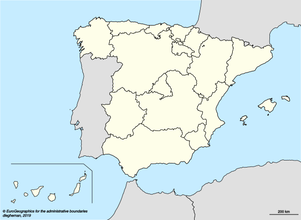
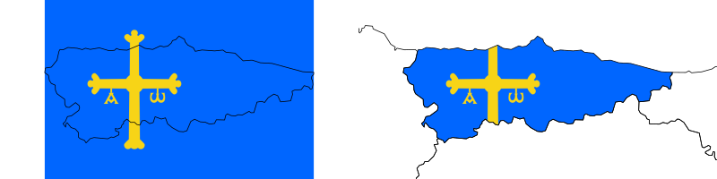
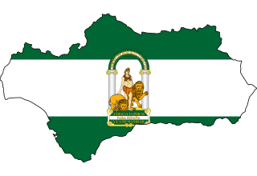
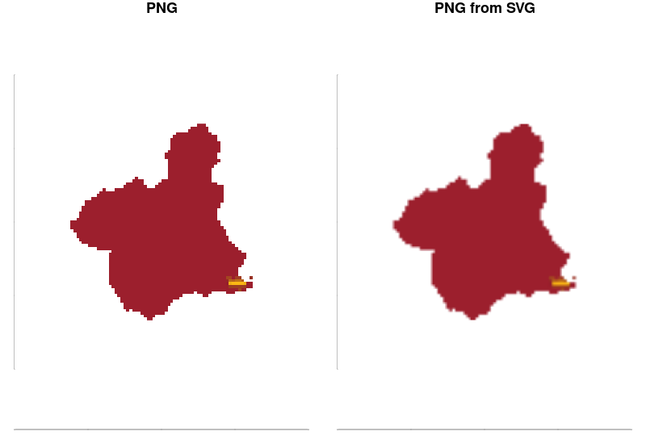
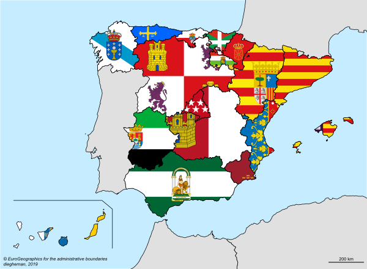

*Updated on 21 January 2020. Blank spaces around the `.png` layer were due to the resolution of the plotting device. Now all the plots are high quality `.svg` files*<a name="update"></a>

Want to use a flag (or any `*.png` file) as a background of your map? You are in the right post. I am aware that there are some **R** packages out [there](https://github.com/RobertMyles/flagfillr) that are designed to do this, but I decided to challenge myself and see if I could make it from scratch. 

After some research on the web I found an article of [Paul Murrell](https://www.stat.auckland.ac.nz/people/pmur002), **"Raster Images in R Graphics"** [(*The R Journal, Volume 3/1, June 2011*)](https://journal.r-project.org/archive/2011/RJ-2011-008/RJ-2011-008.pdf), which was a good starting point. With a little bit more of trial and error, I finally got a solution based in the `raster`package and some support of the `png` package. 

As usual, I wrapped all this research in a function, this time called `stdh_png2map`, that is stored in my [functions folder](https://github.com/dieghernan/dieghernan.github.io/tree/master/assets/functions). This function is designed to work with any `*.png` file, so you can use logos, personal pictures, etc. with it.

### Required R packages


```r
library(png)
library(curl)
library(cartography)
library(raster)
library(sf)
library(dplyr)
```

### Choosing a good source for our shape

In this post I am going to plot a map of Spain with its [autonomous communities (plus 2 autonomous cities)](https://en.wikipedia.org/wiki/Autonomous_communities_of_Spain), that is the first-level administrative division of the country. [Wikipedia](https://en.wikipedia.org/wiki/Autonomous_communities_of_Spain) shows an initial map identifying also the flag of each territory.

The first step is to choose a good map source for my plot. I really like the geodata available in [**Eurostat**](https://ec.europa.eu/eurostat), with information of countries in several formats (`*.geojson`,`*.shp`, etc. ), projections (EPSG [4326](https://epsg.io/4326), [3035](https://epsg.io/3035) and [3857](https://epsg.io/3857)) and resolutions (01M, 03M, 10M, 20M and 60M), accesible via [API](https://ec.europa.eu/eurostat/cache/GISCO/distribution/v2/countries/countries-2016-files.html). 

The map I wanted to work with corresponds to [NUTS level 2 for Spain](https://en.wikipedia.org/wiki/NUTS_statistical_regions_of_Spain), that matches the autonomous regions of Spain. This shape is also available in **Eurostat** via [API](https://ec.europa.eu/eurostat/cache/GISCO/distribution/v2/nuts/nuts-2016-files.html).

<sup>*Note: [NUTS](https://en.wikipedia.org/wiki/Nomenclature_of_Territorial_Units_for_Statistics) (Nomenclature of Territorial Units for Statistics) is the european model for geopolitical subdivisions.*</sup>


```r
SPAIN <- st_read(
  "https://ec.europa.eu/eurostat/cache/GISCO/distribution/v2/nuts/geojson/NUTS_RG_03M_2016_3857_LEVL_2.geojson",
  stringsAsFactors = FALSE
) %>%
  subset(CNTR_CODE == "ES")

WORLD <- st_read(
  "https://ec.europa.eu/eurostat/cache/GISCO/distribution/v2/countries/geojson/CNTR_RG_03M_2016_3857.geojson",
  stringsAsFactors = FALSE
)

# Plot
par(mar = c(0, 0, 0, 0))
plot(st_geometry(SPAIN),
  col = NA,
  border = NA,
  bg = "#C6ECFF"
)
plot(st_geometry(WORLD),
  col = "#E0E0E0",
  bg = "#C6ECFF",
  add = T
)
plot(st_geometry(SPAIN), col = "#FEFEE9", add = T)
layoutLayer(
  title = "",
  frame = FALSE,
  scale = 500,
  sources = "© EuroGeographics for the administrative boundaries",
  author = "dieghernan, 2019",
)
```


First thing to note is that the Canary Islands are still in the same place ;) , far away of Spain's mainland. Just for plotting purposes I am going to place an inset-like map by moving them closer and drawing a box around.


```r
# Move Canary Islands
CAN <- SPAIN %>% subset(NUTS_ID == "ES70")
CANNEW <- st_sf(st_drop_geometry(CAN),
  geometry = st_geometry(CAN) + c(550000, 920000)
)
st_crs(CANNEW) <- st_crs(SPAIN)
# New version of Spain
SPAINV2 <- rbind(
  SPAIN %>%
    subset(NUTS_ID != "ES70"),
  CANNEW
)

# BBoxCan
bboxcan <- CANNEW %>% st_bbox()
coords <- cbind(bboxcan[1], bboxcan[4] + 50000)
coords <- rbind(coords, cbind((bboxcan[3] - 20000), bboxcan[4] + 50000))
coords <- rbind(coords, cbind((bboxcan[3] + 40000), bboxcan[4]))
coords <- rbind(coords, cbind(bboxcan[3] + 40000, bboxcan[2]))
bboxcan <- st_linestring(coords) %>%
  st_sfc(crs = st_crs(CANNEW))

# Plot
par(mar = c(0, 0, 0, 0))
plot(st_geometry(SPAINV2),
  col = NA,
  border = NA,
  bg = "#C6ECFF"
)
plot(st_geometry(WORLD),
  col = "#E0E0E0",
  bg = "#C6ECFF",
  add = T
)
plot(st_geometry(SPAINV2), col = "#FEFEE9", add = T)
plot(st_geometry(bboxcan), add = T)
layoutLayer(
  title = "",
  frame = FALSE,
  sources = "© EuroGeographics for the administrative boundaries",
  author = "dieghernan, 2019",
)
```




Now we have it! A nice map of Spain with a layout based on the [Wikipedia convention for location maps](https://en.wikipedia.org/wiki/Wikipedia:WikiProject_Maps/Conventions/Location_maps).

### Loading the flag

As a first example, I chose [Asturias](https://en.wikipedia.org/wiki/Asturias) to build my code. So the goal here is to create a `RasterBrick` from the desired `*.png` file, add the necessary geographical information and use the shape of Asturias to crop the flag. It seems easy, but I needed to sweat to get the following code ready and working:


```r
# 1.Shape---
shp <- SPAINV2 %>% subset(id == "ES12") # Asturias

# 2.Get flag---
url <- "https://upload.wikimedia.org/wikipedia/commons/thumb/3/3e/Flag_of_Asturias.svg/800px-Flag_of_Asturias.svg.png"
dirfile <- paste(tempdir(), "flag.png", sep = "/")
curl_download(url, dirfile)

# 3.Raster---
flag <- brick(readPNG(dirfile) * 255)
# Geotagging the raster
# Adding proj4string
projection(flag) <- CRS(st_crs(shp)[["proj4string"]])
# Now cover with the flag the whole extent of the shape
ratioflag <- dim(flag)[2] / dim(flag)[1]

# Middle point
extshp <- extent(shp)
w <- (extshp@xmax - extshp@xmin) / 2
h <- (extshp@ymax - extshp@ymin) / 2
w_mp <- extshp@xmin + w
h_mp <- extshp@ymin + h
# Depending of the shape the fitting could be in height or width
if (w > h * ratioflag) {
  new_ext <- c(
    extshp@xmin,
    extshp@xmax,
    h_mp - w / ratioflag,
    h_mp + w / ratioflag
  )
} else {
  new_ext <- c(
    w_mp - h * ratioflag,
    w_mp + h * ratioflag,
    extshp@ymin,
    extshp@ymax
  )
}
extent(flag) <- new_ext
par(mar = c(1, 1, 1, 1), mfrow = c(1, 2))
plotRGB(flag)
plot(st_geometry(shp), add = T)

# 4.Mask---
fig <- mask(flag, shp)
plotRGB(fig, bgalpha = 0)
plot(st_geometry(SPAINV2), add = T)
```




A note on this: I decided to assign the coordinates of the flag (the `extent` property) keeping the original aspect ratio and adjusting it to the width or height of the map. In this sense, it is also assessed whether the map shape is "wide" (`w > h * ratioflag`) or "tall" to determine which dimension should be adjusted.

I have found some interesting things when creating this code:

- It is possible to read `*.png` right through the `raster::brick` function to create a `RasterBrick`. The main problem with that is that for `*.png` files where one channel (Red, Green or Blue) is non present (i.e.monochromatic flags) the `RasterBrick` doesn't plot well. For that reason I preferred to import it with `readPNG` before passing it to the `brick` function.
- When plotting the result with `plotRGB`, use the `bgalpha=0` option, otherwise the non-masked part of the raster would be plotted as well.
- ~~There is a small area close to the borders where the mask doesn't work. I did some tests but I was not able to fix it. Potential workaround are to use a simplified shapefile (lower level of detail) or also overlap the map increasing the width of the border (`lwd=2` in my example)~~ *Solved <i class="fa fa-thumbs-up"></i>. See [update note](#update)*.

### The `stdh_png2map` function

[Here you have](https://github.com/dieghernan/dieghernan.github.io/blob/master/assets/functions/stdh_png2map.R), a complete solution on a function! I made a final adjustment, the parameter `align`, that allows to place the mask in the left, center or right side of the `*.png`, giving the ability to show specific details of the masked figure. This option is only available for "tall" shapes.

Another additional feature is the possibility to use either local `*.png` files or add them via url.


```r
stdh_png2map <- function(sf, png, align = "center") {
  shp <- sf
  if (file.exists(png)) {
    flag <- brick(readPNG(png) * 255)
  } else {
    dirfile <- paste(tempdir(), "flag.png", sep = "/")
    curl_download(png, dirfile)
    flag <- brick(readPNG(dirfile) * 255)
  }
  if (!align %in% c("left", "right", "center")) {
    stop("align should be 'left','right' or 'center'")
  }
  # Geotagging the raster
  # Adding proj4string
  projection(flag) <- CRS(st_crs(shp)[["proj4string"]])
  # Now cover with the flag the whole extent of the shape
  ratioflag <- dim(flag)[2] / dim(flag)[1]

  # Middle point
  extshp <- extent(shp)
  w <- (extshp@xmax - extshp@xmin) / 2
  h <- (extshp@ymax - extshp@ymin) / 2
  w_mp <- extshp@xmin + w
  h_mp <- extshp@ymin + h
  # Depending of the shape the fitting could be in height or width
  if (w > h * ratioflag) {
    new_ext <- c(
      extshp@xmin,
      extshp@xmax,
      h_mp - w / ratioflag,
      h_mp + w / ratioflag
    )
  } else {
    if (align == "center") {
      new_ext <- c(
        w_mp - h * ratioflag,
        w_mp + h * ratioflag,
        extshp@ymin,
        extshp@ymax
      )
    } else if (align == "left") {
      new_ext <- c(
        extshp@xmin,
        extshp@xmin + 2 * h * ratioflag,
        extshp@ymin,
        extshp@ymax
      )
    } else {
      new_ext <- c(
        extshp@xmax - 2 * h * ratioflag,
        extshp@xmax,
        extshp@ymin,
        extshp@ymax
      )
    }
  }
  extent(flag) <- new_ext
  # Mask
  fig <- mask(flag, shp)
  return(fig)
}
```

Here I present an use case for [Andalusia](https://en.wikipedia.org/wiki/Andalusia):


```r
# Run it
AND <- stdh_png2map(
  SPAINV2 %>% subset(id == "ES61"),
  "https://upload.wikimedia.org/wikipedia/commons/thumb/2/20/Flag_of_Andaluc%C3%ADa.svg/800px-Flag_of_Andaluc%C3%ADa.svg.png"
)
# Plot it
par(mar = c(0, 0, 0, 0), mfrow = c(1, 1))
plotRGB(AND)
plot(SPAINV2 %>% subset(id == "ES61") %>% st_geometry(),
  add = T
)
```




{: .box-note}
<i class="fa fa-star"></i> **Pro tip:** Depending on your plotting device, you may notice some white slivers of the `*.png` close to the border of the shapefile. What I have found is that this issue would depend on the setup of the plotting device you are using. If you need a high quality plot I suggest to generate a `*.svg` file, and if needed, convert it to `*.png` via `rsvg::rsvg_png()`. Here I show an extreme example:


```r
MURshp <- subset(SPAIN, id == "ES62")
MUR <- stdh_png2map(
  MURshp,
  "https://upload.wikimedia.org/wikipedia/commons/thumb/a/a5/Flag_of_the_Region_of_Murcia.svg/100px-Flag_of_the_Region_of_Murcia.svg.png"
)

# Files
pngfile <- tempfile(pattern = "topng", fileext = ".png")
svgfile <- tempfile(pattern = "tosvg", fileext = ".svg")
pngconverted <- tempfile(pattern = "tosvg", fileext = ".png")

dpi <- 90

png(pngfile,
  width = 480,
  height = 480,
  pointsize = dpi
)
par(mar = c(0, 0, 0, 0))
plotRGB(MUR, bgalpha = 0)

dev.off()


svg(svgfile,
  width = 480 / dpi,
  height = 480 / dpi,
  pointsize = dpi
)
par(mar = c(0, 0, 0, 0))
plotRGB(MUR, bgalpha = 0)

dev.off()

rsvg::rsvg_png(svgfile, pngconverted)
# Import to rasterbrick

frompng <- brick(readPNG(pngfile) * 255)
fromsvg <- brick(readPNG(pngconverted) * 255)

# Plot and compare
par(mfrow = c(1, 2), mar = c(1, 1, 1, 1))
par(
  col.axis = "white",
  col.lab = "white",
  tck = 0
)
plotRGB(frompng,
  bgalpha = 0,
  axes = T,
  main = "PNG"
)
box(col = "white")
plotRGB(fromsvg,
  bgalpha = 0,
  axes = T,
  main = "PNG from SVG"
)
box(col = "white")
```




Now, we are ready to have [fun with flags](https://the-big-bang-theory.com/fun_with_flags/). It's time to make the flag map of the autonomous communities of Spain.


```r
par(mar = c(0, 0, 0, 0))
plot(
  SPAINV2 %>%
    st_geometry(),
  col = NA,
  border = NA,
  bg = "#C6ECFF"
)
plot(st_geometry(WORLD),
  col = "#E0E0E0",
  add = T
)

plot(st_geometry(bboxcan),
  add = T
)
layoutLayer(
  title = "",
  frame = FALSE,
  sources = "© EuroGeographics for the administrative boundaries",
  author = "dieghernan, 2019",
)

# Asturias
plotRGB(
  stdh_png2map(
    subset(SPAINV2, id == "ES12"),
    "https://upload.wikimedia.org/wikipedia/commons/thumb/3/3e/Flag_of_Asturias.svg/800px-Flag_of_Asturias.svg.png"
  ),
  bgalpha = 0,
  add = T
)
# Andalucia
plotRGB(AND, add = T, bgalpha = 0)
# Aragon
plotRGB(
  stdh_png2map(
    subset(SPAINV2, id == "ES24"),
    "https://upload.wikimedia.org/wikipedia/commons/thumb/1/18/Flag_of_Aragon.svg/800px-Flag_of_Aragon.svg.png",
    align = "left"
  ),
  bgalpha = 0,
  add = T
)

# ...more flags
# Go to the source code of this post on GitHub for the full code

plot(st_geometry(SPAINV2),
  col = NA,
  lwd = 2,
  add = T
)
```



We are done now. If you have suggestion ~~(or you know how to get rid of the annoying white spaces around the shapes)~~ you can leave a comment. As always, if you enjoyed the post you can share it on your preferred social network.


