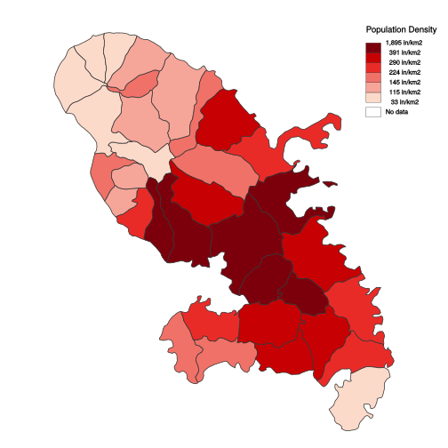
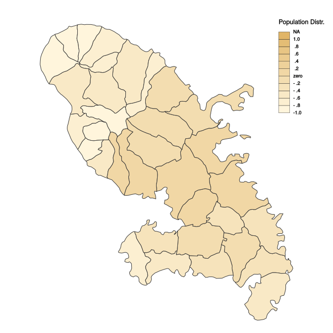
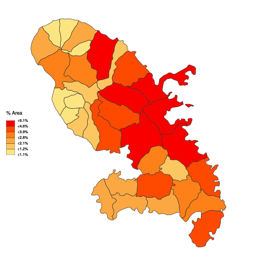
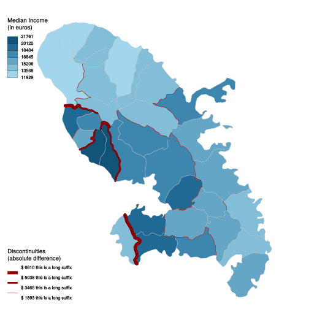
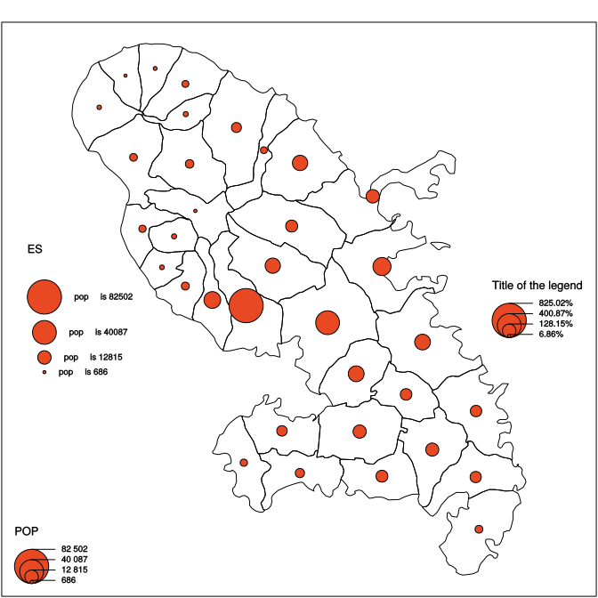

source code: [here](https://github.com/dieghernan/dieghernan.github.io/blob/master/blog/prettylabs.Rmd)

# Installation

``` r
library(devtools)

devtools::install_github("dieghernan/cartography", ref="prettylabs")

library(cartography)
```

# man

## `getFormatNums`: Pretty format for labels

### Description

Convert numeric arrays into formatted strings.

### Usage

``` r
getFormatNums(
  v,
  thousands = "",
  decimals = getOption("OutDec"),
  values.rnd = 0,
  prefix = "",
  suffix = "",
  align = "left",
  leadzero = TRUE,
  replace.zero = NULL
)
```

### Arguments

| Argument         | Description                                                           |
| ---------------- | --------------------------------------------------------------------- |
| `v`              | a vector of numeric values.                                           |
| `thousands`      | thousands separator.                                                  |
| `decimals`       | decimals separator.                                                   |
| `values.rnd`     | desired number of digits after the decimal separator.                 |
| `prefix, suffix` | strings to be pasted before of after the number, see Details.         |
| `align`          | alignment of the final string, possible values are “left” or “right”. |
| `leadzero`       | logical, convert leading zeros to `" ."` for values in (-1,1).        |
| `replace.zero`   | replace zero values for this parameter. See Details.                  |

### Details

If `suffix` contains `"%"` the values are converted to percentages.

`NA` values of `v` are converted to `"NA"` .

If `replace.zero` is not `NULL` , exact zeroes would be replaced for
this value.

### Value

A character vector containing the formatted values.

### Author

dieghernan, <https://github.com/dieghernan/>

### Examples

``` r
library(sf)
## Linking to GEOS 3.5.1, GDAL 2.2.2, PROJ 4.9.2
mtq <-
  st_read(system.file("gpkg/mtq.gpkg", package = "cartography"))
## Reading layer `mtq' from data source `/home/rstudio-user/R/x86_64-pc-linux-gnu-library/3.6/cartography/gpkg/mtq.gpkg' using driver `GPKG'
## Simple feature collection with 34 features and 7 fields
## geometry type:  MULTIPOLYGON
## dimension:      XY
## bbox:           xmin: 690574 ymin: 1592536 xmax: 735940.2 ymax: 1645660
## epsg (SRID):    32620
## proj4string:    +proj=utm +zone=20 +datum=WGS84 +units=m +no_defs
# Population density
mtq$POPDENS <- 1e6 * mtq$POP / st_area(x = mtq)
brks <- getBreaks(mtq$POPDENS, 6)
cols <- carto.pal("red.pal", 6)
labs <- getFormatNums(brks,
                      thousands = ",",
                      suffix = " in/km2",
                      align = "right")

choroLayer(mtq,
           var = "POPDENS",
           col = cols,
           legend.pos = "n")
legendChoro(
  breaks = labs,
  col = cols,
  title.txt = "Population Density",
  pos = "topright"
)
```

<!-- -->

``` r

# Percentage of population
mtq$PORCPOP <- mtq$POP / sum(mtq$POP)

brks <- seq(-1, 1, .2)
brks <- c(brks,NA)
cols = carto.pal("sand.pal", 20)
labs <- getFormatNums(
  brks,
  values.rnd = 2,
  leadzero = FALSE,
  replace.zero = "zero"
)

choroLayer(mtq,
           var = "PORCPOP",
           col = cols,
           legend.pos = "n")

legendChoro(
  breaks = labs,
  col = cols,
  title.txt = "Population Distr.",
  pos = "topright",
  nodata = FALSE
)
```

<!-- -->

``` r

# Area percent
mtq$AREA <- (st_area(mtq) / sum(st_area(mtq)))

brks <- getBreaks(mtq$AREA, method = "q6")
cols = carto.pal("orange.pal", 6)
labs <-
  getFormatNums(brks,
                suffix = "%",
                values.rnd = 1,
                prefix = "<")
choroLayer(mtq,
           var = "AREA",
           legend.pos = "n",
           col = cols)

legendChoro(
  breaks = labs,
  col = cols,
  title.txt = "% Area",
  pos = "left",
  nodata = FALSE
)
```

<!-- -->

# `discLayer` and `legendGradLines`

``` r

library(sf)
mtq <-
  st_read(system.file("gpkg/mtq.gpkg", package = "cartography"))
## Reading layer `mtq' from data source `/home/rstudio-user/R/x86_64-pc-linux-gnu-library/3.6/cartography/gpkg/mtq.gpkg' using driver `GPKG'
## Simple feature collection with 34 features and 7 fields
## geometry type:  MULTIPOLYGON
## dimension:      XY
## bbox:           xmin: 690574 ymin: 1592536 xmax: 735940.2 ymax: 1645660
## epsg (SRID):    32620
## proj4string:    +proj=utm +zone=20 +datum=WGS84 +units=m +no_defs
# Get borders
mtq.borders <- getBorders(x = mtq)
# Median Income
choroLayer(
  x = mtq,
  var = "MED",
  border = "grey",
  lwd = 0.5,
  method = 'equal',
  nclass = 6,
  legend.pos = "topleft",
  legend.title.txt = "Median Income\n(in euros)"
)
# Discontinuities
discLayer(
  x = mtq.borders,
  df = mtq,
  var = "MED",
  col = "red4",
  nclass = 3,
  method = "equal",
  threshold = 0.4,
  sizemin = 0.5,
  sizemax = 10,
  type = "abs",
  legend.values.rnd = 0,
  legend.title.txt = "Discontinuities\n(absolute difference)",
  legend.pos = "bottomleft",
  add = TRUE,
  prefix = "$ ",
  suffix = " this is a long suffix"
)
```

<!-- -->

# `legendCirclesSymbols` (and partially `propSymbolsLayer`)

``` r

library(sf)
mtq <- st_read(system.file("gpkg/mtq.gpkg", package="cartography"))
## Reading layer `mtq' from data source `/home/rstudio-user/R/x86_64-pc-linux-gnu-library/3.6/cartography/gpkg/mtq.gpkg' using driver `GPKG'
## Simple feature collection with 34 features and 7 fields
## geometry type:  MULTIPOLYGON
## dimension:      XY
## bbox:           xmin: 690574 ymin: 1592536 xmax: 735940.2 ymax: 1645660
## epsg (SRID):    32620
## proj4string:    +proj=utm +zone=20 +datum=WGS84 +units=m +no_defs
plot(st_geometry(mtq))
box()

propSymbolsLayer(x = mtq, var = "POP",
                 inches = 0.2, 
                 thousands = " ",
                 decimals =",")


legendCirclesSymbols(pos = "right", inches = 0.2,
                     var = -c(min(mtq$POP), max(mtq$POP))/10000,
                     values.rnd= 4,
                     suffix = "%")
legendCirclesSymbols(pos = "left",
                     title.txt="ES",
                     cex=2,
                     var = c(min(mtq$POP), max(mtq$POP)),
                     inches = 0.2, style = "e",
                     prefix = "pop     is ")
```

<!-- -->
